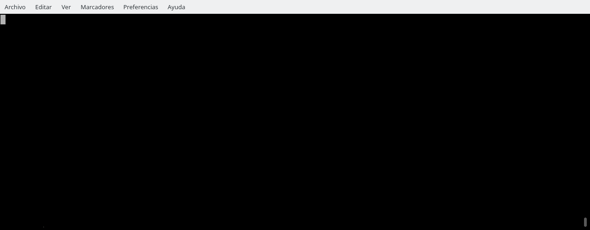
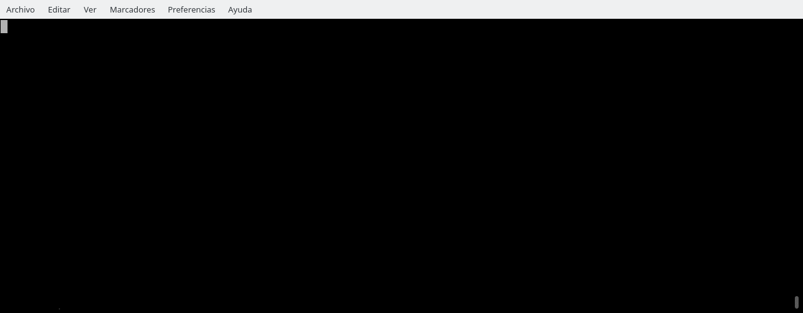

Several small gifs showing specific fades functionality
-------------------------------------------------------

How to cleanly test a Python library from PyPI without having to install
or create anything:

How to use a specific version of a Python library without messing your
system:

How to cleanly test a Python library from GitHub without having to
install or create anything:

How to cleanly test a Python library without having to install or create
anything and using `ipython`:

How to cleanly test a Python 2 library from PyPI without having to install
or create anything:

How to cleanly test multiple Python libraries without having to
install or create anything:

How to get a Python interpreter using some specific requirements:

How to make a Python script to be autonomous, not needing to
remember any virtualenv details:

How to create a Python web project using whatever Django specific version:

How to prepare your Python project for anybody to run it or its
tests without any previous setup:

How to open an isolated Jupyter notebook for Python with `pandas`,
`matplotlib` and `numpy`:

How to run a modern timeit on a code snippet:

How to use a library from a local branch, but isolated from the system:

How to automatically use the latest code to download YouTube videos:

